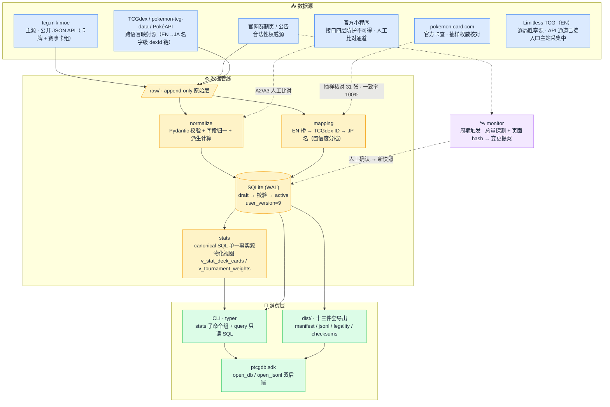

<div align="center">

# 🃏 ptcg-cn-db

**简体中文 PTCG 标准环境卡牌数据库 —— 为 AI 对战模拟而生的数据基建**

[](LICENSE)
[](https://www.python.org/)
[](STATUS.md)
[](docs/简中PTCG卡牌数据库_PRD与技术方案.md)
[](STATUS.md)

[产品需求文档](docs/简中PTCG卡牌数据库_PRD与技术方案.md) · [开发进展](STATUS.md) · [工程约定](AGENTS.md)

</div>

---

## 为什么要有这个项目

简中 PTCG 是一个**独立产品池**——套装结构、编号体系、赛制节奏都与国际版不同，任何国际版数据库（pokemon-tcg-data、TCGdex）都不含简中卡级数据（TCGdex 已收录简中系列壳，但卡级 0%）。官方数据锁在微信小程序里（接口带 JWT+AES+签名四层防护），开源世界也一直没有可用的简中卡数据集。好在 [Cryst's Cards Database（tcg.mik.moe）](https://tcg.mik.moe/) 提供了同源的公开 JSON API（含卡牌与**真实赛事卡组**）——本项目以此为**主数据源**，自建覆盖**简中标准赛制全部合法卡牌**的本地数据库与数据管线，作为「AI 模拟对战 + 卡组强度/胜率测试」工具链的第一块基石。

## ✨ 亮点

- **📸 快照化合法性引擎** —— 赛制标记 + 白名单 + 禁卡表 + 视作覆盖 + 能量种类全部按生效日版本化；旧快照永不删除，可回放任意历史环境（`legal_at('2026-08-01', 'standard')`）
- **🏆 真实赛事卡组管线** —— mik 赛事 API 全链路：34 场赛事（CN mik 26 + EN Limitless 8）/ 1,669 套卡组内容 / 1,823 条出战记录入库，pairings 逐桌对阵 1,184 桌；卡组内容与出战记录分表（同一套 60 张可跨赛事、跨选手复用），`mapping_status` 分档、只统计可映射简中环境的卡组；**三赛区旋转日历种子**（`config/tournament_envs.yml`）+ 赛事日期推导环境落库，CN/EN/JP 环境标号对齐有方案（FR-9.1b）；EN 侧 Limitless 双通道接入（API 通道已入库、主站 HTML 收录通道采集中），`basis` 口径标签不与 CN 混同
- **📊 可复算的统计三指标** —— 加权出场率 WUR / 胜率 WR（逐局战绩与 top-cut 转化率两层口径）/ 加权胜率 WWS（贝叶斯收缩）；**公式只在 canonical SQL 文件里**（单一事实源），权重输入全量落库，任何人都能用 SQL 原样重放官方数字
- **🔍 像写 SQL 一样查库** —— `ptcgdb query` 只读 ad-hoc SQL（mode=ro，拒写操作）；导出 DB 自带统计物化视图，口径词表 hash 版本化进 meta
- **🌏 三语卡名映射** —— 简中卡 99.3% 挂英文桥（12,337 张），经 TCGdex + pokemon-tcg-data + PokéAPI 链路填充日文名 9,480 张；映射来源经 `external_ids` 体系逐条可溯，pokemon-card.com 官方抽样 31 张核对一致率 100%
- **🔌 规则语义一等公民的 SDK** —— 合法性：`legal_at` / `effective_text`；卡组校验：`validate_deck`（结构化违规列表，banned/not_legal 互斥）；统计：`stats_usage` / `stats_winrate` / `stats_wws`；`open_db` / `open_jsonl` 双后端同一接口、契约测试保一致
- **📦 十三件套导出契约** —— `manifest.json` + 八份 JSONL（cards / sets / relations + 赛事五表含 pairings）+ `legality.json` + 只读 SQLite + `schema.md` + `checksums.sha256`，字段只加不删；双轨版本化（日历版本管数据，SemVer 管 schema），对齐 MTGJSON/Scryfall 惯例
- **🔄 分级自动更新** —— L0 新卡每日增量入库、L1 赛制页变更自动生成提案、L2 勘误人工维护；目标新包发售 30 分钟内完成更新
- **🛡️ 原文保真** —— `text_raw` 逐字保留绝不规范化，原文与派生字段严格分层；DB vs raw 同源自验 + 三清单日志保证数据质量
- **📐 卡面口径保真** —— 卡号分母逐系列种子口径（`sets.card_face_total`，实测数据点驱动），种子未覆盖系列只显分子不伪装；字母编号能量卡的 mik 双重列示以 `alias_of` 归并到数字正本
- **🔮 机制全覆盖且前瞻** —— ex / 太晶（ptcd subtypes 印刷级识别，is_tera 166 张）/ ACE SPEC / 训练家宝可梦 / V-UNION / GX，词表开放，超级进化ex 等新机制直接进库

## 🚀 快速预览

> 当前库内数据：**129 系列 / 12,420 张卡**（active，三语卡名 EN 12,337 / JA 9,480）· **73 场赛事（CN 26 + EN Limitless API 8 + 主站 39）/ 2,592 套卡组 / 2,982 条出战 / pairings 1,184 桌** · 合法卡池 standard 5,320 / open 12,413。以下接口均已可用（开发进度见 Roadmap）。

**CLI**

```bash
# ── 采集与入库（mik.moe 主源，限速 2s/请求）──
ptcgdb scrape sets && ptcgdb scrape cards      # 采集卡牌
ptcgdb scrape tourneys --series-id 54          # 采集赛事卡组
ptcgdb scrape limitless && ptcgdb ingest-limitless   # EN 对齐窗口 API 通道（Limitless 在线赛）
ptcgdb scrape limitless-site && ptcgdb ingest-limitless-site   # EN 主站收录通道（官方大赛 Top Cut）
ptcgdb ingest --set CSV10C                     # 卡牌入库（raw → draft）
ptcgdb ingest-tourneys                         # 赛事入库（60 张质量门）
ptcgdb validate && ptcgdb activate             # FR-2.3 六规则校验 → active

# ── 合法性与卡组校验 ──
ptcgdb legal --date 2026-08-01 --format standard   # 某日期的合法卡池（standard 5,320 / open 12,413）
ptcgdb deck-check --file deck.yml              # FR-8 卡组校验（ok 退 0 / 违规 1 / 错误 2）

# ── 统计与查询 ──
ptcgdb stats usage --window-days 90            # 加权出场率 WUR（--basis cn/intl_aligned | winrate / wws / card <名>）
ptcgdb query "SELECT * FROM v_stat_deck_cards LIMIT 5"   # 只读 ad-hoc SQL
ptcgdb export --out dist/                      # 导出十三件套

# ── 更新管线与验收 ──
ptcgdb monitor l0 --dry-run                    # L0 新卡增量探测；monitor l1 赛制页监控 → 提案
ptcgdb accept && ptcgdb sample                 # 一键验收 A1~A8；A2/A3 抽样比对清单

# ── 跨语言与机制映射 ──
ptcgdb map-en && ptcgdb map-tcgdex && ptcgdb map-ja   # EN 桥 → TCGdex ID → JP 名
ptcgdb map-tera                                # 太晶识别：ptcd EN subtypes → is_tera
```

**SDK**

```python
from ptcgdb.sdk import open_db

db = open_db("data/ptcg-cn.db")               # 或 open_jsonl("dist/")，同一接口
pool = db.legal_at(date="2026-08-01", format="standard")   # -> LegalityPool
text = db.effective_text("CSM2DC-339", date="2026-08-01")  # 勘误 > 最新印刷 > 原文
usage = db.stats_usage(window_days=90)        # -> StatsResult[CardStat]，meta 回显口径+词表 hash
boss = db.stats_card("老大的指令")             # 单卡 drilldown（按赛事/按系列）
cards = db.search_cards(name="喵喵", marks=("G", "H", "I"))
report = db.validate_deck(my_deck, date="2026-08-01", format="standard")   # -> DeckReport（结构化违规列表）
```

## 🏗️ 架构



## 🗺️ Roadmap

- ✅ **M0** 主数据源决策（D1 = 路线 B：mik.moe 公开 API；小程序接口四层防护否决）
- ✅ **Phase 1a** schema 建库 + 全卡首批入库（129 系列 / 12,420 张）+ 校验报告
- ✅ **Phase 1b** 环境快照 + 合法性引擎 + 版本化/回滚 + 导出 + SDK 双后端
- ✅ **Phase 1c** L0/L1 自动更新管线 + M4 验收 A1~A8 全过（赶在 2026-09-16 新包发售前就位）
- 🔄 **Phase 2**（数据质量与扩展）
  - ✅ **M5** 进化解析：跨系列回退解析，未解析 401→5（仅剩化石豁免）
  - ✅ **M6** 跨语言映射：EN 桥 12,337（99.3%）→ TCGdex ID 12,322（99.88%）→ JP 名 9,480（官方抽样 100%）
  - ✅ **M7** 同名计数引擎 + `validate_deck` SDK 双后端 + CLI deck-check（真实卡组 408/408 全过）
  - ✅ **M8（A2）** 卡面人工比对 100/100 核销 + 三件技术债清偿（卡号分母逐系列种子 / 字母能量 `alias_of` / 太晶识别 is_tera 166）
  - ✅ **M9-1/2** 赛事卡组管线 CN mik + 统计可复算与查询层
  - 🔄 **M8（A3）** 50 张特殊卡比对，待协作 session
  - ✅ **M9-3** EN Limitless 对齐窗口接入（task 028）：API + 主站 HTML 双通道（官方系列赛归类 + 名次截断 `config/site_tournament_rules.yml` 配置化 + decklist→简中映射链含 paren_strip 回退 + pairings 落库），73 赛 / 2,592 卡组 / 2,982 出战，主站 923 卡组 full=425、NAIC 2025 对账 12/12；`basis` 口径标签不与 CN 混同（FR-9.1a/b）；**范围收口：以当前简中环境为起点收集维护，历史不回填**
  - ⬜ **赛事数据刷新管线**（task 031）：赛事增量入库 + mapping 随卡库重算 + EN 赛后重抓 + 词表变更重物化
- ⬜ **Phase 3** 效果标签层，配合规则引擎
- ⬜ **Phase 4** 对战模拟与胜率统计（独立库，主库只读）

> ⚠️ 临近事件：**2026-09-16「30周年庆典」全球同步发售**（简中首次同步，新罕贵度 FUR），更新管线将迎来首次实战。

## 📚 文档

| 文档 | 内容 |
|---|---|
| [PRD v1.15](docs/简中PTCG卡牌数据库_PRD与技术方案.md) | 权威设计：赛制调研、数据模型、合法性引擎、导出契约、SDK 设计、跨语言映射、赛事卡组与统计基建（FR-9 可复算性契约 / FR-9.1a 对齐筛选口径 / FR-9.1b 环境推导落库） |
| [数据源与接口文档](docs/data-sources.md) | 全部数据源获取方式：mik.moe 主源 API（卡牌 + 赛事）、官网赛制页、TCGdex / pokemon-tcg-data / PokéAPI、Limitless / TopDeck / RK9 与 JP 卡组聚合站（task 028 调研）、pokemon-card.com 抽样核对 |
| [STATUS.md](STATUS.md) | 当前阶段、里程碑进度、决策日志、技术债 |
| [CHANGELOG.md](CHANGELOG.md) | 版本变更（四段式，数据日历版本 + schema SemVer 双轨） |
| [AGENTS.md](AGENTS.md) | 工程约定与技术红线（协作者/AI 共读） |

## 🙏 致谢与对标

站在这些项目的肩膀上：[pokemon-tcg-data](https://github.com/PokemonTCG/pokemon-tcg-data) · [TCGdex](https://github.com/tcgdex/cards-database) · [PokéAPI](https://github.com/PokeAPI/pokeapi) · [type-null/PTCG-database](https://github.com/type-null/PTCG-database) · [TCG ONE](https://github.com/axpendix/tcgone-engine-contrib) · [ryuu-play](https://github.com/keeshii/ryuu-play) · [Limitless TCG](https://play.limitlesstcg.com/) · [MTGJSON](https://mtgjson.com/) · [Cryst's Cards Database](https://tcg.mik.moe/)

## ⚖️ 合规声明

本项目与 Nintendo、The Pokémon Company、宝可梦（上海）**无任何隶属或背书关系**。卡面文本与卡牌数据版权归宝可梦（上海）/ The Pokémon Company 所有；本项目**不采集、不存储、不分发卡图**，卡牌数据库不进入本仓库、不公开分发，仅限本地研究与工具自用。

## 📄 License

代码与文档基于 [MIT License](LICENSE) 发布（卡牌数据版权见上方声明，不在许可范围内）。
