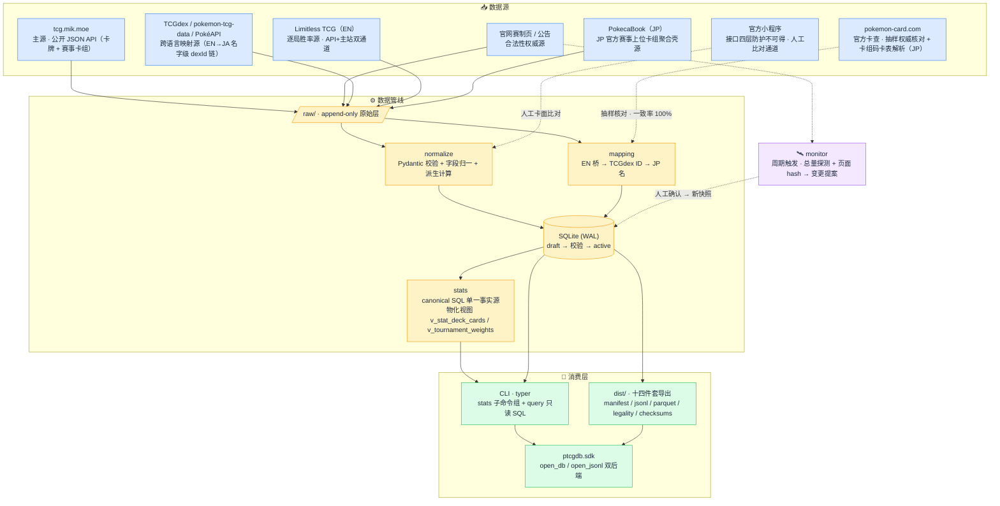

<div align="center">

# 🃏 ptcg-cn-db

**简体中文 PTCG 标准环境卡牌数据库 —— 为 AI 对战模拟而生的数据基建**

[](LICENSE)
[](https://www.python.org/)
[](STATUS.md)
[](docs/简中PTCG卡牌数据库_PRD与技术方案.md)
[](STATUS.md)

[产品需求文档](docs/简中PTCG卡牌数据库_PRD与技术方案.md) · [开发进展](STATUS.md) · [工程约定](AGENTS.md)

</div>

---

## 为什么要有这个项目

简中 PTCG 是一个**独立产品池**——套装结构、编号体系、赛制节奏都与国际版不同，任何国际版数据库（pokemon-tcg-data、TCGdex）都不含简中卡级数据（TCGdex 已收录简中系列壳，但卡级 0%）。官方数据锁在微信小程序里（接口带 JWT+AES+签名四层防护），开源世界也一直没有可用的简中卡数据集。好在 [Cryst's Cards Database（tcg.mik.moe）](https://tcg.mik.moe/) 提供了同源的公开 JSON API（含卡牌与**真实赛事卡组**）——本项目以此为**主数据源**，自建覆盖**简中标准赛制全部合法卡牌**的本地数据库与数据管线，作为「AI 模拟对战 + 卡组强度/胜率测试」工具链的第一块基石。

## ✨ 亮点

- **📸 快照化合法性引擎** —— 赛制标记 + 白名单 + 禁卡表 + 视作覆盖 + 能量种类全部按生效日版本化；旧快照永不删除，可回放任意历史环境（`legal_at('2026-08-01', 'standard')`）。当前快照：standard（G/H/I/J，2026-09-16 起生效）/ open
- **🏆 真实赛事卡组管线（CN/EN/JP 三赛区）** —— 283 场赛事 / 10,760 套卡组 / 13,999 条出战记录 / 479 桌逐局对阵入库；卡组内容与出战记录分表（同一套 60 张可跨赛事、跨选手复用）；三赛区旋转日历 + 赛事日期自动推导环境标号，CN/EN/JP 样本以 `basis` 口径隔离互不混同；EN 侧 Limitless **API + 主站双通道**（官方大赛 Top Cut，含 Worlds 2025 与亚洲联赛），JP 侧聚合站壳 + 官方卡组码卡表解析
- **📊 可复算的统计指标 + 对阵矩阵** —— 加权出场率 WUR / 胜率 WR（逐局战绩与 top-cut 转化率两层口径，支持镜像局剔除）/ 加权胜率 WWS（贝叶斯收缩）/ matchup 对阵矩阵（archetype×archetype 逐局胜率）；**公式只在 canonical SQL 文件里**（单一事实源），权重输入全量落库，任何人都能用 SQL 原样重放每一个数字
- **🔍 像写 SQL 一样查库** —— `ptcgdb query` 只读 ad-hoc SQL；导出 DB 自带统计物化视图，口径词表 hash 版本化进 meta
- **🌏 三语卡名映射** —— 简中卡 99.3% 挂英文桥（12,337 张），日文名 11,046 张；映射来源经 `external_ids` 体系逐条可溯，pokemon-card.com 官方抽样核对一致率 100%
- **🔌 规则语义一等公民的 SDK** —— 合法性 `legal_at` / `effective_text`；卡组校验 `validate_deck`（结构化违规列表）；统计 `stats_usage` / `stats_winrate` / `stats_wws` / `stats_matchup`；卡组查询 `get_deck` / `list_decks`；`open_db` / `open_jsonl` 双后端同一接口、契约测试保一致
- **📦 十四件套导出契约** —— `manifest.json` + 八份 JSONL + `cards.parquet`（DuckDB 直读免灌库）+ `legality.json` + 只读 SQLite + `schema.md` + `checksums.sha256`；字段只加不删，双轨版本化（日历版本管数据，SemVer 管 schema），对齐 MTGJSON/Scryfall 惯例
- **🔄 分级自动更新** —— L0 新卡每日增量入库、L1 赛制页变更自动生成提案、L2 勘误人工维护；目标新包发售 30 分钟内完成更新
- **🛡️ 原文保真** —— `text_raw` 逐字保留绝不规范化，原文与派生字段严格分层；DB 与 raw 同源自验保证数据质量
- **📐 卡面口径保真** —— 卡号分母逐系列种子口径（实测数据点驱动），种子未覆盖系列只显分子不伪装；mik 双重列示的字母编号能量卡以 `alias_of` 归并到数字正本
- **🔮 机制全覆盖且前瞻** —— ex / 太晶（177 张，双信号源交叉识别）/ ACE SPEC / 训练家的宝可梦（owner 归属 212 张）/ V-UNION（四部件方位结构化，24 张齐全）/ GX / 超级进化ex；词表开放，新机制直接进库
- **🏷️ 效果标签层** —— 29 意图标签 + 3 机制 flag 词表（`config/vocabularies/effect_tags.yml` 唯一事实源，开放追加零代码）；确定性规则匹配 + 人工兜底复核（不猜），段级与**句级**双层打标（23,082 句逐句归类，全库 unknown=0）；这是下游规则引擎/AI 模拟的数据接缝

## 🔧 安装与初始化

```bash
git clone https://github.com/Bingtuu/ptcg-cn-db.git && cd ptcg-cn-db
python -m venv .venv && source .venv/Scripts/activate   # Windows Git Bash；类 Unix 用 .venv/bin/activate
pip install -e .         # 依赖含 pyarrow（parquet 导出）；装出 CLI 入口 ptcgdb
ptcgdb init-db           # 建库 + 全部迁移（默认 data/ptcg-cn.db）
```

> **数据库本体不随仓库分发**（见合规声明）。拿到数据的两条路：
> ① **自行跑管线**：`ptcgdb scrape sets && ptcgdb scrape cards`（限速 2s/请求，全量约数小时）→ `ptcgdb ingest` → `ptcgdb validate` → `ptcgdb activate`；
> ② **消费导出件**：已有 `dist/` 时直接 `open_jsonl("dist/")` 或 `duckdb` 直读 `cards.parquet`，无需建库。

开发自检：

```bash
python -m pytest -q      # 1120 测试（全量约 5 分钟）
ruff check .
```

## 🚀 快速预览

> 当前库内数据：**133 系列 / 12,908 张卡**（active；三语卡名 EN 12,337+ / JA 11,046+）· **283 场赛事（CN 123 + EN 54 + JP 106）/ 10,760 套卡组 / 13,999 条出战 / pairings 479 桌** · 合法卡池 standard 5,701 / open 12,879（@2026-09-19，赛制 2026-09-16 版）。

### CLI 速查

```bash
# ── 采集与入库（mik.moe 主源，限速 2s/请求）──
ptcgdb scrape sets && ptcgdb scrape cards      # 采集卡牌（索引页 24h TTL 自动刷新，增量不会漏）
ptcgdb ingest --set CSV10C                     # 卡牌入库（raw → draft）
ptcgdb validate && ptcgdb activate             # 全规则校验（含 text_raw 逐字保真）→ active
ptcgdb scrape tourneys                         # 采集赛事卡组
ptcgdb ingest-tourneys                         # 赛事入库（60 张质量门）
ptcgdb scrape limitless && ptcgdb ingest-limitless           # EN 通道（Limitless 在线赛）
ptcgdb scrape limitless-site && ptcgdb ingest-limitless-site # EN 主站通道（官方大赛 Top Cut）
ptcgdb scrape jp-shells && ptcgdb scrape jp-decks && ptcgdb ingest-jp   # JP 通道
ptcgdb scrape swiss                            # 瑞士轮实时积分榜快照（仅进行中赛事，快照留存）

# ── 更新管线与验收 ──
ptcgdb monitor l0 --dry-run                    # L0 新卡增量探测（去掉 --dry-run 即正式跑）
ptcgdb monitor l1                              # L1 赛制页监控 → 变更提案；monitor proposals 查看
ptcgdb monitor tourneys                        # 赛事增量刷新：采集 → 入库一站跑完
ptcgdb accept                                  # 一键验收 A1~A8（真实库只读）
```

### 合法性查询

```bash
# 某日期某赛制的合法卡池规模与白名单命中
ptcgdb legal --date 2026-09-19 --format standard
ptcgdb legal --date 2026-08-01 --format open       # 历史日期回放（旧快照永不删除）

# 卡组校验：准备一份卡表 YAML（cards = card_id → 数量）
cat > deck.yml <<'EOF'
format: standard
date: 2026-09-19
cards:
  CSV10C-001: 4     # 阿响的凯罗斯
  CSV10C-003: 3     # 远古巨蜓ex
  CSV10C-004: 4     # 竹兰的毒蔷薇
  # ... 合计 60 张
EOF
ptcgdb deck-check --file deck.yml                  # 合法退 0 / 有违规退 1 / 输入错误退 2
ptcgdb deck-check --file deck.yml --format open    # CLI 选项覆盖文件内的 format/date
```

### 统计与查询

```bash
ptcgdb stats usage --window-days 90                # 加权出场率 WUR（默认 basis=cn）
ptcgdb stats usage --granularity archetype         # 卡组级粒度：什么卡组强
ptcgdb stats usage --basis jp                      # JP 赛区样本
ptcgdb stats winrate --layer a --mirror exclude --basis intl_aligned --from 2025-04-01
                                                   # A 层逐局胜率（镜像局剔除，pairings 覆盖赛事）
ptcgdb stats wws --layer b                         # 加权胜率 WWS（贝叶斯收缩）
ptcgdb stats matchup --basis intl_aligned --from 2025-04-01 --min-n 3
                                                   # matchup 对阵矩阵（archetype×archetype）
ptcgdb stats card 老大的指令                       # 单卡钻取（逐赛事/逐系列）
ptcgdb stats card 沙奈朵 --granularity archetype   # 单 archetype 钻取
ptcgdb stats usage --format json                   # table|json|csv 三种输出（所有 stats 子命令通用）

# 只读 ad-hoc SQL（mode=ro，仅 SELECT/WITH，默认 LIMIT 500）
ptcgdb query "SELECT name_full, rarity FROM cards WHERE set_id='30thC' AND rarity='RGB'"
ptcgdb query "SELECT * FROM v_stat_deck_cards LIMIT 5" --format csv

# 导出十四件套到 dist/（--no-parquet 可跳过 parquet）
ptcgdb export --out dist/
```

### 跨语言与标签管线（建库后跑一次即可）

```bash
ptcgdb map-en && ptcgdb map-tcgdex && ptcgdb map-ja    # EN 桥 → TCGdex ID → JP 名
ptcgdb map-ja-trainer && ptcgdb map-tera               # trainer 日文名补强 / 太晶识别
ptcgdb tag-effects                                     # 效果标签标注落库（幂等，可重跑）
ptcgdb backfill-misses && ptcgdb remap-decks           # 赛事卡组映射缺口回填 / 刷新
```

### SDK

```python
from ptcgdb.sdk import open_db

db = open_db("data/ptcg-cn.db")               # 或 open_jsonl("dist/")，同一接口
pool = db.legal_at(date="2026-09-19", format="standard")   # -> LegalityPool
text = db.effective_text("CSM2DC-339", date="2026-09-19")  # 勘误 > 最新印刷 > 原文
usage = db.stats_usage(window_days=90)        # -> StatsResult[CardStat]，meta 回显口径+词表 hash
arch = db.stats_usage(granularity="archetype")            # 卡组级：什么卡组强
wr = db.stats_winrate(layer="a", mirror="exclude", basis="intl_aligned", date_from="2025-04-01")
matchup = db.stats_matchup(basis="intl_aligned", date_from="2025-04-01")   # 对阵矩阵
decks = db.list_decks(archetype="沙奈朵", date_from="2026-07-01")   # 批量拉取（默认只回 full 卡组）
deck = db.get_deck("mik_moe:607870")          # 单卡组：内容 + 60 张卡表 + 出战史
boss = db.stats_card("老大的指令")            # 单卡 drilldown
cards = db.search_cards(name="喵喵", marks=("G", "H", "I", "J"))
report = db.validate_deck(my_deck, date="2026-09-19", format="standard")   # -> DeckReport
```

### DuckDB 直读 parquet（OLAP 分析）

```python
import duckdb   # 下游自选：dist/cards.parquet 免灌库直查
duckdb.sql("SELECT name_full, effect_tags FROM 'dist/cards.parquet' LIMIT 5")
```

## 📏 统计口径速览

> 完整定义见 PRD 第 9 章；所有口径以 `ptcgdb/stats/sql/*.sql` canonical SQL 为单一事实源，CLI/SDK/导出三处共用。

- **统计范围**：仅宝可梦/支援者/竞技场进统计（能量/物品/道具不进）；卡级粒度 = name_group（跨印刷同名合并）；只消费 `mapping_status='full'` 的卡组。
- **WR 两层口径**：A 层（Limitless，逐局/战绩）与 B 层（mik 无逐局，代理 = top-cut 转化率）互不混算，`basis` 标签（cn / intl_aligned / jp）隔离赛区样本。
- **镜像剔除（`--mirror`）**：`include`（默认）= standings record 汇总口径；`exclude` = 仅消费 pairings 覆盖赛事，逐局剔除双方同含该卡的镜像局（镜像判定要求双侧卡组 full）。两口径数据源不同（逐局 vs 汇总），数值不相等属预期，meta 各自标注。
- **matchup 矩阵**：archetype×archetype 有向逐局胜率（平局计 0.5），消费源站卡组归类名、不按 mapping_status 过滤；同 archetype 内战不进矩阵；winner 空局（平局/未报不可区分）排除出 n 并在 meta 回显。
- **archetype 粒度（`--granularity archetype`）**：统计单元从卡级 name_group 切到卡组归类名（源站事实，不归并同名不同写）；卡组级去重（一套卡组一权重）；archetype 缺失的出战条目排除并计数回显；跨语言命名分裂不治理——basis 内各自同源一致，`--basis all` 混合时如实呈现并附警告。
- **低样本**：n 低于阈值打 `low_confidence`；一切输出的 meta 回显 as_of / 窗口 / 口径 / 词表 hash，可原样重放。
- **窗口注意**：pairings 覆盖赛事集中在 2025-06 前后，exclude / matchup 口径需显式 `--from 2025-04-01` 级别的窗口，默认 90 天滚动窗内可能为空集（诚实结果，非 bug）。

## 🏗️ 架构


```mermaid
flowchart TB
    subgraph SRC["📥 数据源"]
        A["tcg.mik.moe<br/>主源 · 公开 JSON API（卡牌 + 赛事卡组）"]
        B["官网赛制页 / 公告<br/>合法性权威源"]
        C["官方小程序<br/>接口四层防护不可得 · 人工比对通道"]
        D["TCGdex / pokemon-tcg-data / PokéAPI<br/>跨语言映射源（EN→JA 名字级 dexId 链）"]
        E["pokemon-card.com<br/>官方卡查 · 抽样权威核对 + 卡组码卡表解析（JP）"]
        F["Limitless TCG（EN）<br/>逐局胜率源 · API+主站双通道"]
        G["PokecaBook（JP）<br/>JP 官方赛事上位卡组聚合壳源"]
    end

    subgraph PIPE["⚙️ 数据管线"]
        RAW[/"raw/ · append-only 原始层"/]
        NORM["normalize<br/>Pydantic 校验 + 字段归一 + 派生计算"]
        MAP["mapping<br/>EN 桥 → TCGdex ID → JP 名"]
        DB[("SQLite (WAL)<br/>draft → 校验 → active")]
        STATS["stats<br/>canonical SQL 单一事实源<br/>物化视图 v_stat_deck_cards / v_tournament_weights"]
    end

    subgraph OUT["🔌 消费层"]
        CLI["CLI · typer<br/>stats 子命令组 + query 只读 SQL"]
        DIST["dist/ · 十四件套导出<br/>manifest / jsonl / parquet / legality / checksums"]
        SDK["ptcgdb.sdk<br/>open_db / open_jsonl 双后端"]
    end

    MON["🛰️ monitor<br/>周期触发 · 总量探测 + 页面 hash → 变更提案"]

    A --> RAW
    B --> RAW
    D --> RAW
    F --> RAW
    G --> RAW
    RAW --> NORM --> DB
    RAW --> MAP --> DB
    E -.->|抽样核对 · 一致率 100%| MAP
    C -.->|人工卡面比对| NORM
    DB --> STATS
    STATS --> CLI
    DB --> CLI
    DB --> DIST
    CLI --> SDK
    DIST --> SDK
    B -.-> MON
    MON -.->|人工确认 → 新快照| DB

    classDef source fill:#dbeafe,stroke:#3b82f6,color:#1e293b;
    classDef pipe fill:#fef3c7,stroke:#f59e0b,color:#1e293b;
    classDef out fill:#dcfce7,stroke:#22c55e,color:#1e293b;
    classDef mon fill:#f3e8ff,stroke:#a855f7,color:#1e293b;
    class A,B,C,D,E,F,G source;
    class RAW,NORM,MAP,DB,STATS pipe;
    class CLI,DIST,SDK out;
    class MON mon;
```

## 🗺️ Roadmap

- ✅ **M0** 主数据源决策（mik.moe 公开 API；官方小程序接口四层防护否决）
- ✅ **Phase 1** 卡牌库 + 合法性引擎 + 更新管线：schema 建库与全卡首批入库 → 环境快照 / 版本化回滚 / 导出 / SDK 双后端 → L0/L1 自动更新管线 → 验收 A1~A8 全过
- ✅ **Phase 2** 数据质量与扩展：跨系列进化解析 · 三语映射（EN 桥 12,337 / JP 名 11,046）· 同名计数引擎与 `validate_deck` · 卡面人工比对复核（一致率 100%）· **赛事卡组管线三赛区**（CN mik + EN Limitless 双通道 + JP 卡组码通道）与可复算统计基建 · 范围收口：以当前简中环境为起点收集维护，历史不回填
- ✅ **Phase 3** 效果标签层：29 意图标签 + 3 机制 flag 词表 · 全库首标 unknown=0 · 人工抽检复核 · 句级打标（规则引擎/AI 模拟的数据接缝，效果 DSL 归下游项目）
- ✅ **Phase 4** 统计深化与模拟基建：pairings 消费层（镜像剔除 + matchup 矩阵）· archetype 级统计 · `cards.parquet` 导出 + 对战模拟数据契约（模拟结果永远落独立库，主库只读）
- ✅ **持续运营**：新包发售日 L0 自动增量全链验证（「30周年庆典」2026-09-16 全球同步发售当日收编 30thC/30thP/30thDC/MP，active 12,908 张 / 133 系列）· 赛制快照随官方赛制页滚动（当前 2026-09-16 版：standard G/H/I/J）· CN 赛事退赛后补采集与增量刷新管线
- ⬜ **后续** 对战模拟引擎与 AI 策略（下游项目，本 repo 提供数据契约与关联键）

## 📚 文档

| 文档 | 内容 |
|---|---|
| [PRD v1.34](docs/简中PTCG卡牌数据库_PRD与技术方案.md) | 权威设计：赛制调研、数据模型、合法性引擎、导出契约（十四件套）、SDK 设计、跨语言映射、赛事卡组与统计基建、效果标签策略、对战模拟数据契约 |
| [数据源与接口文档](docs/data-sources.md) | 全部数据源获取方式：mik.moe 主源 API（卡牌 + 赛事）、官网赛制页、TCGdex / pokemon-tcg-data / PokéAPI、Limitless 与 JP 卡组聚合站、pokemon-card.com 抽样核对 |
| [STATUS.md](STATUS.md) | 当前阶段、里程碑进度、决策日志、技术债 |
| [CHANGELOG.md](CHANGELOG.md) | 版本变更（四段式，数据日历版本 + schema SemVer 双轨） |
| [AGENTS.md](AGENTS.md) | 工程约定与技术红线（协作者/AI 共读） |

## 🙏 致谢与对标

站在这些项目的肩膀上：[pokemon-tcg-data](https://github.com/PokemonTCG/pokemon-tcg-data) · [TCGdex](https://github.com/tcgdex/cards-database) · [PokéAPI](https://github.com/PokeAPI/pokeapi) · [type-null/PTCG-database](https://github.com/type-null/PTCG-database) · [TCG ONE](https://github.com/axpendix/tcgone-engine-contrib) · [ryuu-play](https://github.com/keeshii/ryuu-play) · [Limitless TCG](https://play.limitlesstcg.com/) · [PokecaBook](https://pokecabook.com/) · [MTGJSON](https://mtgjson.com/) · [Cryst's Cards Database](https://tcg.mik.moe/)

## ⚖️ 合规声明

本项目与 Nintendo、The Pokémon Company、宝可梦（上海）**无任何隶属或背书关系**。卡面文本与卡牌数据版权归宝可梦（上海）/ The Pokémon Company 所有；本项目**不采集、不存储、不分发卡图**，卡牌数据库不进入本仓库、不公开分发，仅限本地研究与工具自用。

## 📄 License

代码与文档基于 [MIT License](LICENSE) 发布（卡牌数据版权见上方声明，不在许可范围内）。
